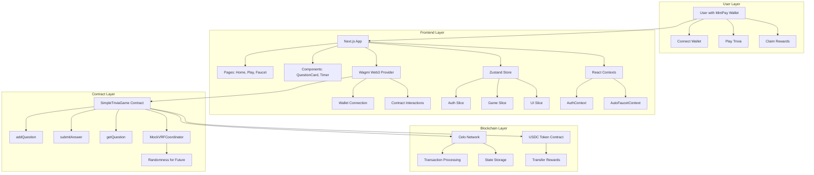
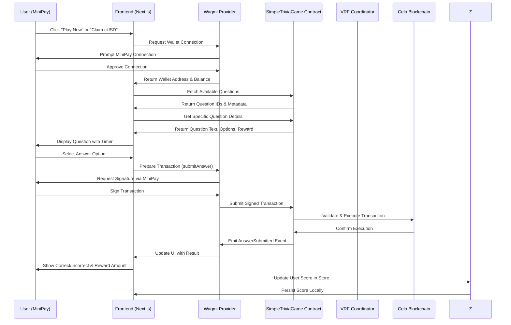
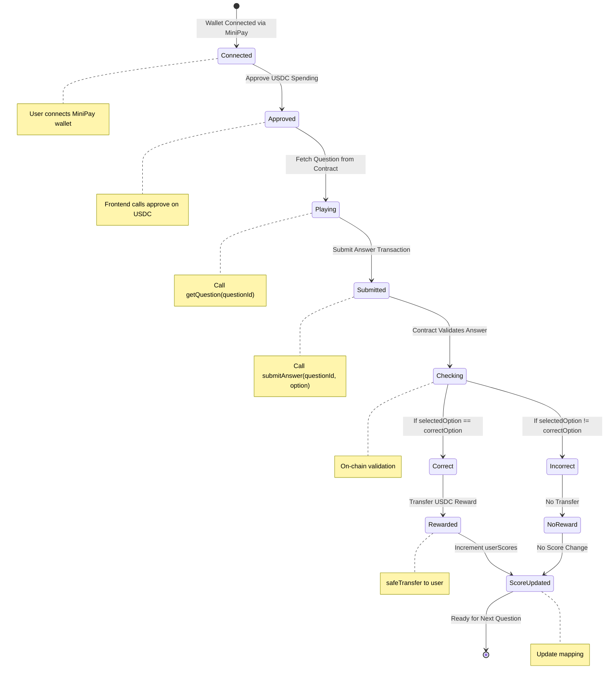
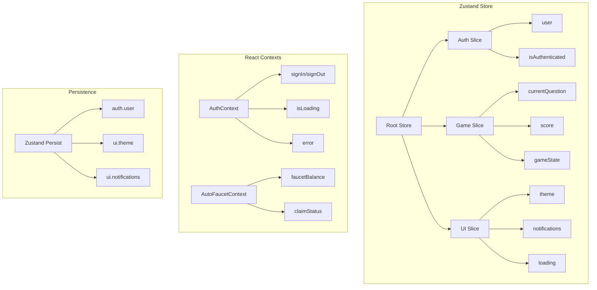
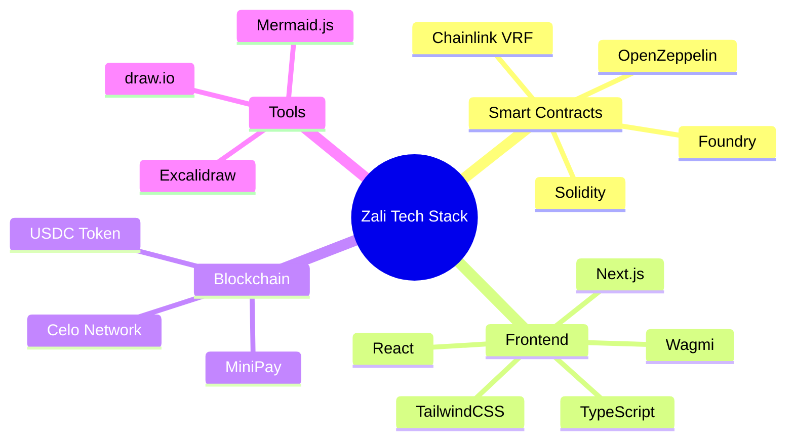

# Architecture Diagrams

This document contains visual architecture diagrams for the Zali project to help new contributors understand the system.

## System Architecture



## Data Flow



## Smart Contract Interactions



## Component Hierarchy

```mermaid
graph TD
    A[Root App] --> B[AppKitProvider (WalletConnect)]
    A --> C[AuthProvider (Wallet Auth)]
    A --> D[AutoFaucetProvider (Faucet Logic)]
    B --> E[Layout (Main Structure)]
    E --> F[Navbar (Navigation)]
    E --> G[Main Content (Pages)]
    G --> H[Home Page (/)]
    G --> I[Play Page (/play)]
    G --> J[Faucet Page (/faucet)]
    H --> K[Hero Section (Welcome)]
    H --> L[Features Section (How It Works)]
    H --> M[Stats Section (Game Stats)]
    I --> N[QuestionCard (Question Display)]
    I --> O[Timer (Countdown)]
    I --> P[ProgressBar (Game Progress)]
    I --> Q[RewardCard (Reward Display)]
    J --> R[FaucetPrompt (Claim Interface)]
    J --> S[QuickRewards (Reward Options)]
    N --> T[Option Buttons (A/B/C/D)]
    Q --> U[RewardItem (Individual Reward)]
    F --> V[SignOutButton (Logout)]
    F --> W[Leaderboard (Top Players)]
    W --> X[PointsHistory (User History)]
```

## State Management




## Data Flow


## Smart Contract Interactions


## Component Hierarchy

```mermaid
graph TD
    A[Root App] --> B[AppKitProvider (WalletConnect)]
    A --> C[AuthProvider (Wallet Auth)]
    A --> D[AutoFaucetProvider (Faucet Logic)]
    B --> E[Layout (Main Structure)]
    E --> F[Navbar (Navigation)]
    E --> G[Main Content (Pages)]
    G --> H[Home Page (/)]
    G --> I[Play Page (/play)]
    G --> J[Faucet Page (/faucet)]
    H --> K[Hero Section (Welcome)]
    H --> L[Features Section (How It Works)]
    H --> M[Stats Section (Game Stats)]
    I --> N[QuestionCard (Question Display)]
    I --> O[Timer (Countdown)]
    I --> P[ProgressBar (Game Progress)]
    I --> Q[RewardCard (Reward Display)]
    J --> R[FaucetPrompt (Claim Interface)]
    J --> S[QuickRewards (Reward Options)]
    N --> T[Option Buttons (A/B/C/D)]
    Q --> U[RewardItem (Individual Reward)]
    F --> V[SignOutButton (Logout)]
    F --> W[Leaderboard (Top Players)]
    W --> X[PointsHistory (User History)]
```

## State Management


## Keeping Diagrams Updated

To ensure these diagrams remain accurate as the codebase evolves:

1. **Review on Major Changes**: Update diagrams when adding new features, refactoring components, or changing data flows.
2. **Code Reviews**: Include diagram updates in pull request reviews for architectural changes.
3. **Documentation PRs**: Treat diagram updates as part of documentation maintenance.
4. **Automated Checks**: Consider adding CI checks to validate diagram syntax (Mermaid can be linted).

### Tools Used
- **Mermaid.js**: For creating diagrams embedded in Markdown
- **GitHub**: For hosting and rendering diagrams
- **VS Code**: For editing and previewing diagrams
```

## Keeping Diagrams Updated

When making changes to the codebase, please update these diagrams accordingly:

- **System Architecture**: Update when adding new services, layers, or external dependencies
- **Data Flow**: Modify when user interaction flows change or new API endpoints are added
- **Smart Contract Interactions**: Update when contract functions or logic change
- **Component Hierarchy**: Reflect when new components are added or hierarchy changes
- **State Management**: Update when new slices, contexts, or state properties are introduced

Use Mermaid.js for consistency and ensure diagrams remain readable and accurate.

## Development Workflow

```mermaid
graph LR
    A[Developer] --> B[Edit Code]
    B --> C[Run Tests]
    C --> D[Deploy Contracts]
    D --> E[Update Frontend]
    E --> F[Build & Deploy]
    F --> G[Update Diagrams]
    G --> H[Commit Changes]
    H --> I[Push to Repo]
    I --> J[Create PR]
    J --> K[Code Review]
    K --> L[Merge]
    L --> M[Deploy to Prod]
```



## Tech Stack Overview

