# Zali Architecture Diagrams

## Overview

This document provides visual architecture diagrams for the Zali trivia game application. These diagrams help new contributors understand the system structure, data flow, and component interactions.

**Tools Used:**
- Mermaid.js for interactive diagrams (embedded in markdown)
- SVG-compatible for rendering in GitHub

---

## 1. System Architecture Diagram

Overall application structure showing frontend, backend, blockchain, and external services.

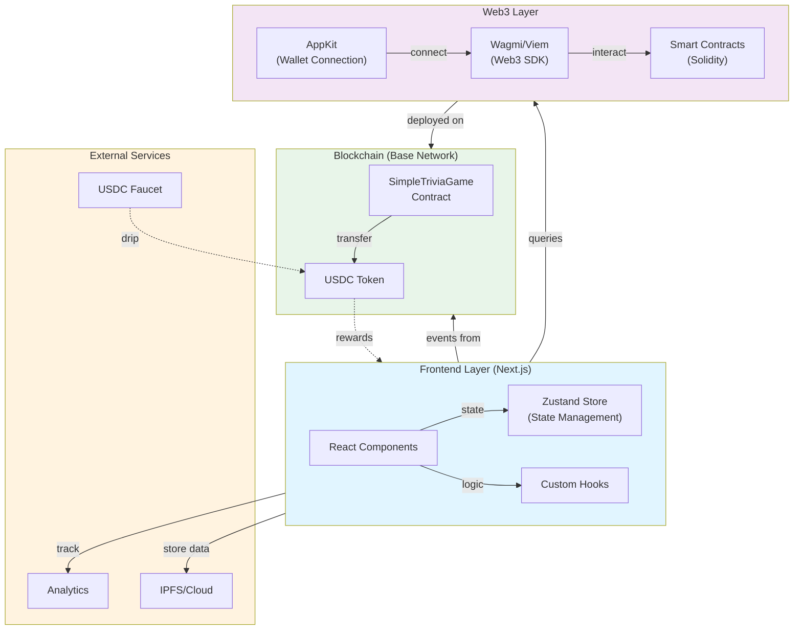

---

## 2. Data Flow Diagram

How data flows from user action through the application to blockchain and back.

```mermaid
graph LR
    subgraph UserAction["User Action"]
        A["Player connects<br/>wallet"]
    end
    
    subgraph FrontendProcessing["Frontend Processing"]
        B["UI Component<br/>renders"]
        C["User selects<br/>answer"]
        D["Zustand store<br/>updates"]
    end
    
    subgraph Web3Interaction["Web3 Interaction"]
        E["Wagmi prepares<br/>transaction"]
        F["AppKit shows<br/>signature request"]
        G["Wallet signs<br/>transaction"]
    end
    
    subgraph BlockchainExecution["Blockchain Execution"]
        H["SimpleTriviaGame<br/>verifies answer"]
        I["Check if correct"]
        J["Transfer USDC<br/>reward"]
        K["Update score<br/>mapping"]
    end
    
    subgraph EventHandling["Event Handling"]
        L["Contract emits<br/>AnswerSubmitted event"]
        M["Frontend listens<br/>for event"]
        N["Update local state<br/>& UI"]
    end
    
    A --> B --> C --> D --> E --> F --> G
    G --> H --> I
    I -->|correct| J --> K
    I -->|incorrect| K
    K --> L --> M --> N

    style UserAction fill:#ffebee
    style FrontendProcessing fill:#e1f5ff
    style Web3Interaction fill:#f3e5f5
    style BlockchainExecution fill:#e8f5e9
    style EventHandling fill:#fce4ec
```

---

## 3. Smart Contract Interactions Diagram

How the frontend interacts with smart contracts on the blockchain.

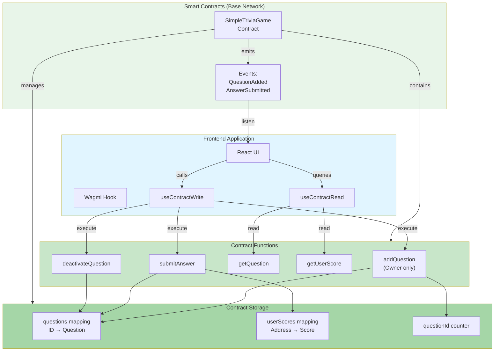

---

## 4. Component Hierarchy Diagram

Frontend component tree showing parent-child relationships and data flow.

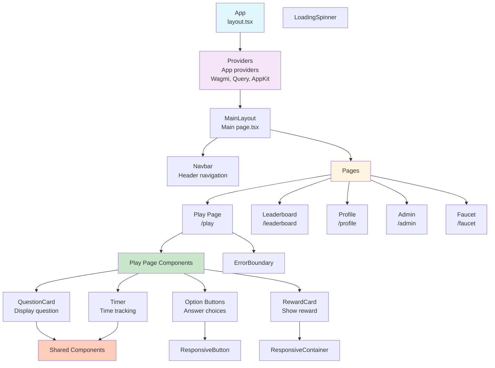

---

## 5. State Management Architecture

Zustand store structure and state slices.

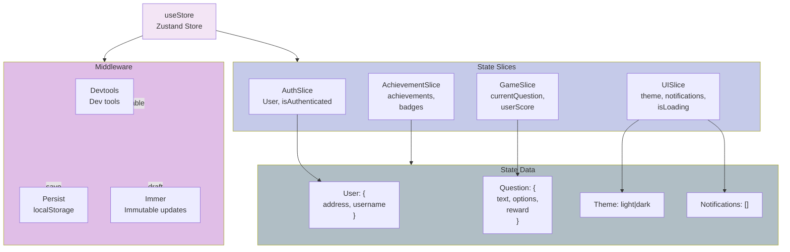

---

## 6. API and Data Layer

External APIs and data fetching patterns.

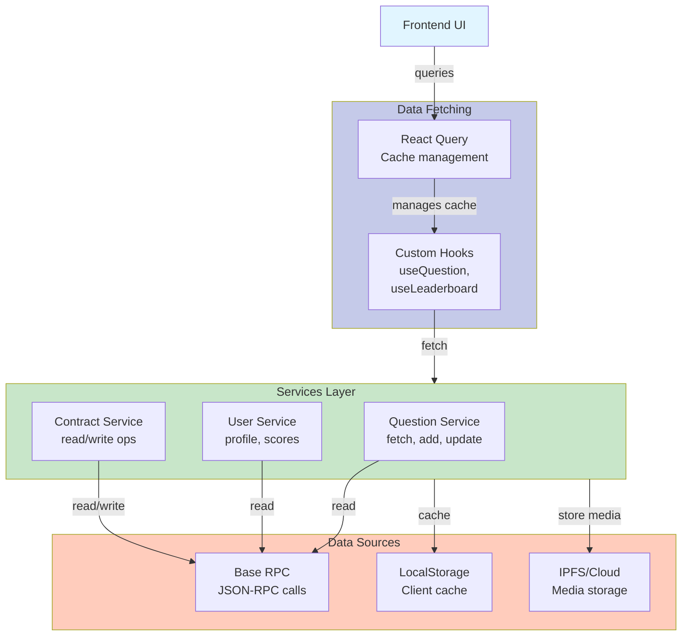

---

## 7. Authentication & Authorization Flow

User authentication and permission system.

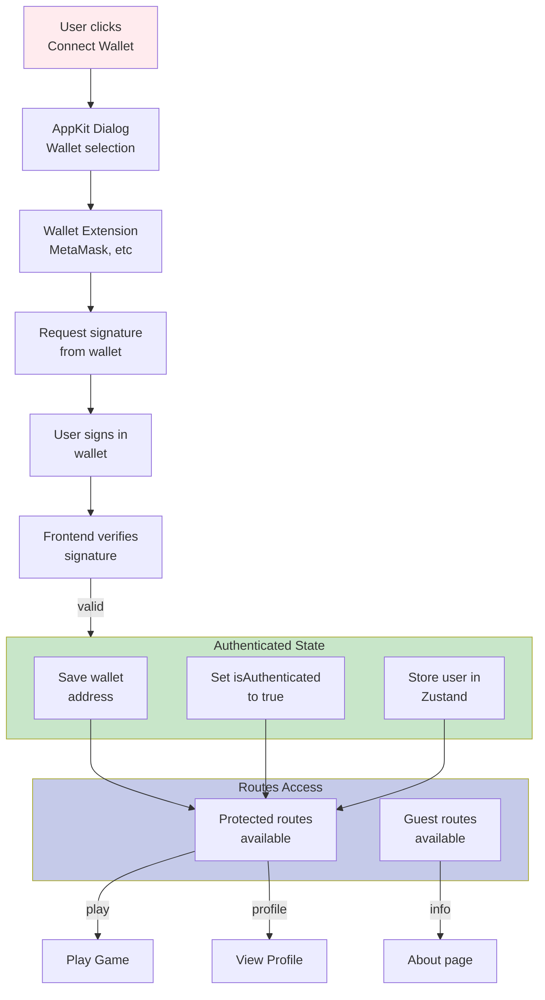

---

## 8. Error Handling Architecture

How errors are caught and handled throughout the application.

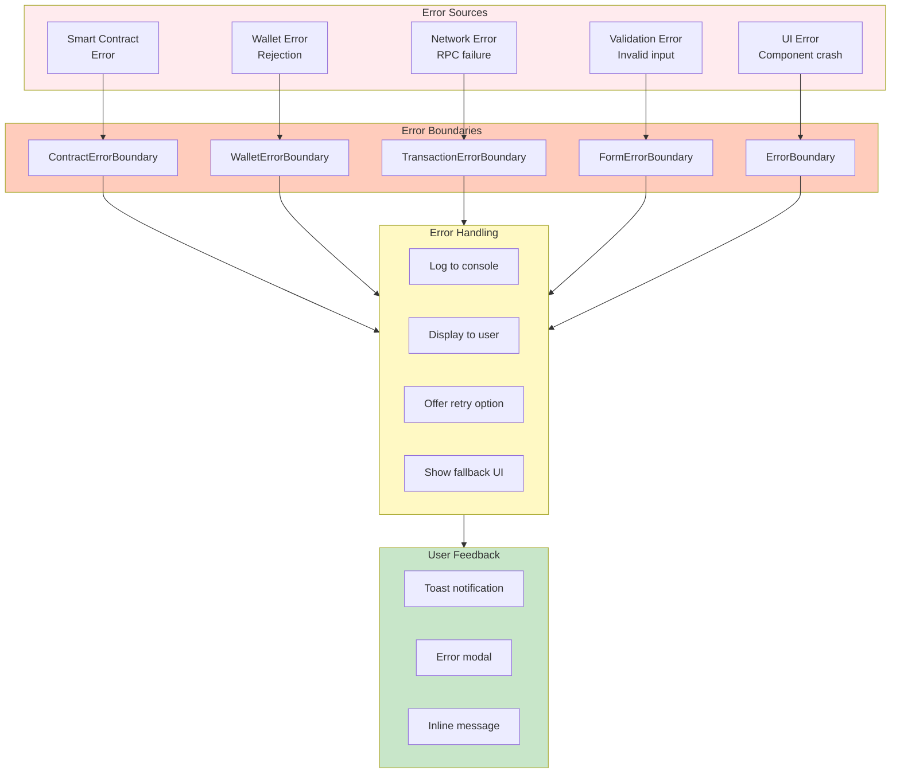

---

## 9. Request/Response Cycle

Complete cycle of a user answering a question.

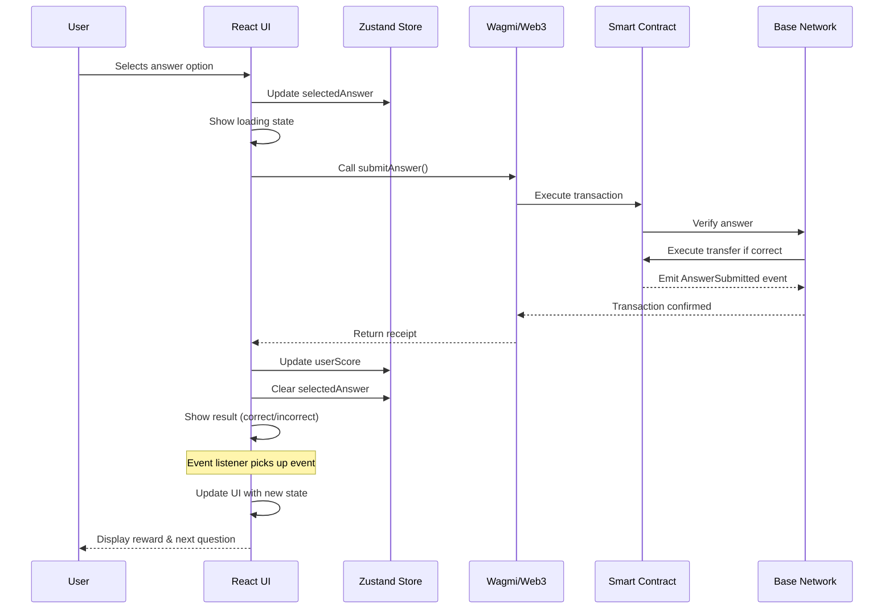

---

## 10. File Structure Organization

```
Zali/
├── contracts/
│   ├── src/
│   │   ├── SimpleTriviaGame.sol          ← Main trivia game contract
│   │   ├── Faucet.sol                    ← USDC faucet
│   │   └── MockVRFCoordinatorV3.sol      ← Testing VRF
│   ├── script/
│   │   └── DeploySimpleMainnet.s.sol     ← Deployment script
│   └── test/
│       ├── Faucet.t.sol
│       ├── TriviaGame.t.sol
│       └── TestUtils.sol
│
├── frontend/
│   ├── src/
│   │   ├── app/                          ← Next.js app router
│   │   │   ├── page.tsx                  ← Home page
│   │   │   ├── play/                     ← Game play page
│   │   │   ├── leaderboard/              ← Rankings
│   │   │   ├── profile/                  ← User profile
│   │   │   ├── admin/                    ← Admin panel
│   │   │   └── providers.tsx             ← Provider setup
│   │   ├── components/
│   │   │   ├── QuestionCard.tsx
│   │   │   ├── Leaderboard.tsx
│   │   │   ├── *.ErrorBoundary.tsx       ← Error boundaries
│   │   │   └── ...                       ← 40+ components
│   │   ├── hooks/
│   │   │   ├── useContract.ts
│   │   │   └── ...
│   │   ├── store/
│   │   │   ├── index.ts                  ← Zustand store
│   │   │   └── slices/
│   │   │       ├── authSlice.ts
│   │   │       ├── gameSlice.ts
│   │   │       ├── uiSlice.ts
│   │   │       └── achievementSlice.ts
│   │   ├── services/
│   │   │   ├── questionService.ts
│   │   │   ├── contractService.ts
│   │   │   └── ...
│   │   ├── types/
│   │   │   └── index.ts                  ← TypeScript types
│   │   └── utils/
│   │       ├── formatters.ts
│   │       └── validators.ts
│   ├── config/
│   │   ├── contracts.ts
│   │   └── web3.ts                       ← Wagmi config
│   ├── public/
│   │   └── ...
│   └── package.json
│
├── docs/
│   ├── ARCHITECTURE_DIAGRAMS.md          ← This file
│   ├── README.md
│   └── ...
│
└── README.md
```

---

## 11. Component Communication Pattern

How components communicate with each other and share state.

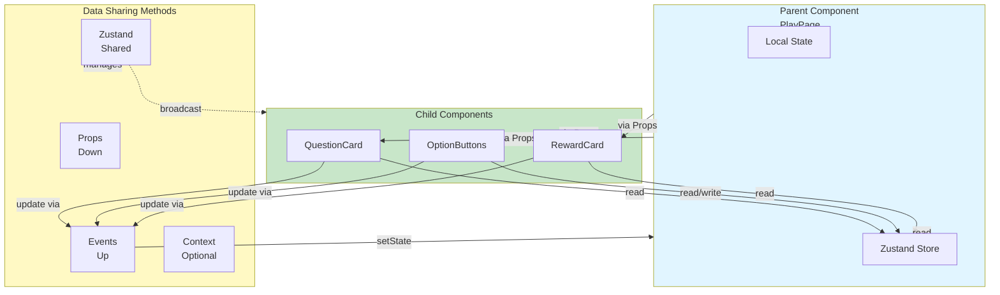

---

## 12. Dependency Flow

External dependencies and their relationships.

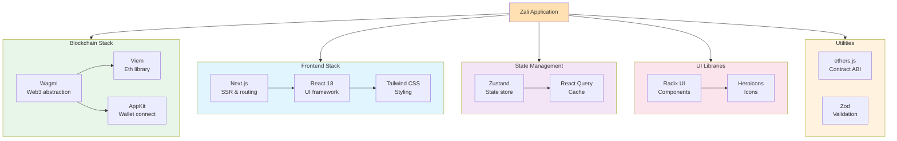

---

## Key Architectural Decisions

### 1. **Zustand for State Management**
- ✅ Lightweight and simple
- ✅ No boilerplate
- ✅ Built-in TypeScript support
- ✅ Easy to persist to localStorage

### 2. **Wagmi for Web3 Integration**
- ✅ React hooks for contract interaction
- ✅ Automatic wallet connection management
- ✅ Built-in caching with TanStack Query
- ✅ TypeScript support

### 3. **Next.js App Router**
- ✅ Server components by default (performance)
- ✅ Built-in routing and middleware
- ✅ API routes for backend
- ✅ Image optimization

### 4. **Error Boundaries Strategy**
- ✅ Granular error boundaries per concern
- ✅ Graceful degradation
- ✅ User-friendly error messages
- ✅ Easy to test and maintain

### 5. **Component Hierarchy**
- ✅ Flat component structure where possible
- ✅ Shared components at top level
- ✅ Page-specific components in route folders
- ✅ Easy to refactor and reuse

---

## Data Flow Summary

```
User Action
    ↓
React Component
    ↓
Zustand Store (local state)
    ↓
Wagmi Hook (Web3 interaction)
    ↓
Smart Contract (blockchain)
    ↓
Event Emission
    ↓
Event Listener (frontend)
    ↓
Update Store
    ↓
Component Re-render
    ↓
UI Update
```

---

## Performance Considerations

### Frontend Optimization
- React Query caching prevents duplicate requests
- Zustand persistence reduces refetching
- Next.js image optimization for assets
- Code splitting at route level

### Blockchain Optimization
- Batch read operations where possible
- Minimal state writes
- Gas-efficient contract design
- Event-driven updates

### Network Optimization
- RPC call batching
- Connection pooling
- Request deduplication
- Fallback RPC endpoints

---

## Security Considerations

### Smart Contract Level
- Access control (Ownable)
- SafeERC20 for token transfers
- Input validation
- Reentrancy protection (inherent)

### Frontend Level
- Signature verification
- Input sanitization
- XSS prevention (React escaping)
- CSRF tokens (for API routes)

### Wallet Integration
- AppKit manages secure connections
- Private key never exposed to frontend
- Signature-based authentication
- Hardware wallet support

---

## Testing Architecture

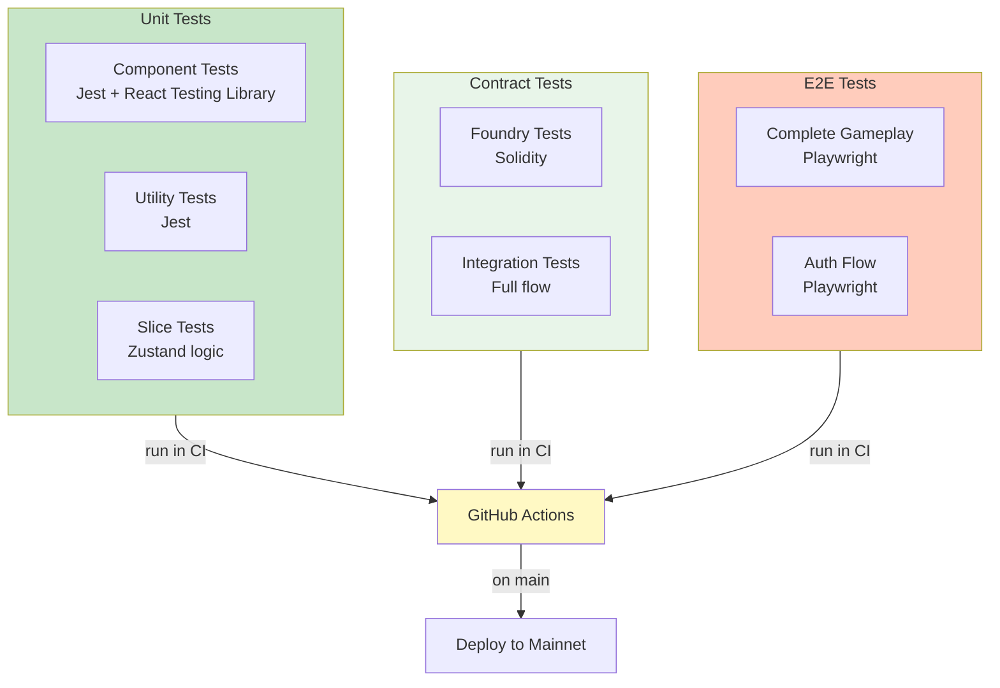

---

## Deployment Architecture

```mermaid
graph LR
    Dev["Development<br/>Local network"]
    Test["Testing<br/>Testnet"]
    Staging["Staging<br/>Base Testnet"]
    Prod["Production<br/>Base Mainnet"]
    
    Dev -->|merge PR| Test
    Test -->|release tag| Staging
    Staging -->|approval| Prod
    
    Style Dev fill:#e1f5ff
    Style Test fill:#fff9c4
    Style Staging fill:#ffccbc
    Style Prod fill:#c8e6c9
```

---

## Related Documentation

- [VERSION_COMPARISON.md](VERSION_COMPARISON.md) - Feature comparison
- [SIMPLE_TRIVIA_GAME_SPEC.md](contracts/SIMPLE_TRIVIA_GAME_SPEC.md) - Contract API
- [INTEGRATION_EXAMPLES.md](INTEGRATION_EXAMPLES.md) - Code examples
- [README.md](README.md) - Project overview

---

**Document Version:** 1.0  
**Last Updated:** January 26, 2026  
**Status:** Complete

Keep these diagrams updated as the architecture evolves!
