# Architecture Documentation Index

Complete guide to all architecture diagrams and system documentation for the Zali project.

---

## 📚 Quick Navigation

### System Overview
- **[ARCHITECTURE_DIAGRAMS.md](ARCHITECTURE_DIAGRAMS.md)** - Main system architecture, components, and relationships
- **[DATA_FLOW_ARCHITECTURE.md](DATA_FLOW_ARCHITECTURE.md)** - Data flow, deployment, and CI/CD pipeline
- **[This file](ARCHITECTURE_INDEX.md)** - Navigation guide (you are here)

### Component Details
- **[FRONTEND_COMPONENTS.md](FRONTEND_COMPONENTS.md)** - React component hierarchy and organization
- **[CONTRACT_ARCHITECTURE.md](CONTRACT_ARCHITECTURE.md)** - Smart contract structure and interactions

### Other Documentation
- **[VERSION_COMPARISON.md](VERSION_COMPARISON.md)** - SimpleTriviaGame v1.0 vs TriviaGameV2 v2.0
- **[SIMPLE_TRIVIA_GAME_SPEC.md](contracts/SIMPLE_TRIVIA_GAME_SPEC.md)** - Contract API specification
- **[INTEGRATION_EXAMPLES.md](INTEGRATION_EXAMPLES.md)** - Code examples for integration

---

## 🗺️ Diagram Categories

### System Level (Start Here!)

```mermaid
graph LR
    Start["🟢 START:<br/>New Contributor"] --> Overview["Overview<br/>ARCHITECTURE_<br/>DIAGRAMS.md"]
    Overview --> Components["Components<br/>FRONTEND_<br/>COMPONENTS.md"]
    Components --> SmartContracts["Smart Contracts<br/>CONTRACT_<br/>ARCHITECTURE.md"]
    SmartContracts --> DataFlow["Data Flow<br/>DATA_FLOW_<br/>ARCHITECTURE.md"]

    style Start fill:#c8e6c9
    style Overview fill:#e1f5ff
    style Components fill:#f3e5f5
    style SmartContracts fill:#e8f5e9
    style DataFlow fill:#fff9c4
```

### All Diagrams Reference

| # | Diagram | Location | Purpose |
|---|---------|----------|---------|
| 1 | System Architecture | ARCHITECTURE_DIAGRAMS.md | Overall app structure |
| 2 | Data Flow | ARCHITECTURE_DIAGRAMS.md | How data moves |
| 3 | Smart Contract Interactions | ARCHITECTURE_DIAGRAMS.md | Web3 flow |
| 4 | Component Hierarchy | ARCHITECTURE_DIAGRAMS.md | Frontend tree |
| 5 | State Management | ARCHITECTURE_DIAGRAMS.md | Zustand store |
| 6 | API & Data Layer | ARCHITECTURE_DIAGRAMS.md | Services & data sources |
| 7 | Authentication Flow | ARCHITECTURE_DIAGRAMS.md | User auth |
| 8 | Error Handling | ARCHITECTURE_DIAGRAMS.md | Error boundaries |
| 9 | Request/Response Cycle | ARCHITECTURE_DIAGRAMS.md | Complete transaction |
| 10 | File Structure | ARCHITECTURE_DIAGRAMS.md | Project organization |
| 11 | Component Communication | ARCHITECTURE_DIAGRAMS.md | Props & events |
| 12 | Dependencies | ARCHITECTURE_DIAGRAMS.md | External packages |
| 13 | Route Structure | FRONTEND_COMPONENTS.md | Next.js routes |
| 14 | Play Page Components | FRONTEND_COMPONENTS.md | Game UI structure |
| 15 | Leaderboard Components | FRONTEND_COMPONENTS.md | Rankings UI |
| 16 | Profile Page | FRONTEND_COMPONENTS.md | User profile |
| 17 | Admin Dashboard | FRONTEND_COMPONENTS.md | Admin interface |
| 18 | Shared Components | FRONTEND_COMPONENTS.md | 40+ reusable components |
| 19 | Error Boundaries | FRONTEND_COMPONENTS.md | Error handling |
| 20 | Custom Hooks | FRONTEND_COMPONENTS.md | React hooks |
| 21 | Services Layer | FRONTEND_COMPONENTS.md | Business logic |
| 22 | Component Reusability | FRONTEND_COMPONENTS.md | Component patterns |
| 23 | Contract Structure | CONTRACT_ARCHITECTURE.md | Solidity code |
| 24 | Function Call Flow | CONTRACT_ARCHITECTURE.md | Function interactions |
| 25 | State Modification | CONTRACT_ARCHITECTURE.md | Transaction flow |
| 26 | Access Control | CONTRACT_ARCHITECTURE.md | Permissions |
| 27 | Data Structures | CONTRACT_ARCHITECTURE.md | Mappings & structs |
| 28 | Events | CONTRACT_ARCHITECTURE.md | Event emissions |
| 29 | Gas Optimization | CONTRACT_ARCHITECTURE.md | Performance |
| 30 | Error Handling | CONTRACT_ARCHITECTURE.md | Contract errors |
| 31 | Integration Points | CONTRACT_ARCHITECTURE.md | External contracts |
| 32 | Upgrade Path | CONTRACT_ARCHITECTURE.md | V1 → V2 upgrade |
| 33 | Testing Strategy | CONTRACT_ARCHITECTURE.md | Test organization |
| 34 | Security Audit | CONTRACT_ARCHITECTURE.md | Security points |
| 35 | User Flow | DATA_FLOW_ARCHITECTURE.md | Complete user journey |
| 36 | Transaction Lifecycle | DATA_FLOW_ARCHITECTURE.md | TX from UI to chain |
| 37 | State Synchronization | DATA_FLOW_ARCHITECTURE.md | State coordination |
| 38 | Data Request Patterns | DATA_FLOW_ARCHITECTURE.md | Read/write patterns |
| 39 | Error Recovery | DATA_FLOW_ARCHITECTURE.md | Error handling |
| 40 | Dev Environment | DATA_FLOW_ARCHITECTURE.md | Local development |
| 41 | Production Deployment | DATA_FLOW_ARCHITECTURE.md | Mainnet setup |
| 42 | CI/CD Pipeline | DATA_FLOW_ARCHITECTURE.md | GitHub Actions |
| 43 | Frontend Data Fetching | DATA_FLOW_ARCHITECTURE.md | React Query |
| 44 | Real-Time Events | DATA_FLOW_ARCHITECTURE.md | Event subscriptions |
| 45 | Error Boundaries | DATA_FLOW_ARCHITECTURE.md | Error strategy |
| 46 | Performance | DATA_FLOW_ARCHITECTURE.md | Optimization flows |
| 47 | State Persistence | DATA_FLOW_ARCHITECTURE.md | Storage strategy |

---

## 🎯 Learning Paths

### Path 1: Game Developer (5-10 minutes)

Want to understand how the game works?

1. Read: **System Architecture** (ARCHITECTURE_DIAGRAMS.md #1)
2. View: **User Flow Diagram** (DATA_FLOW_ARCHITECTURE.md #35)
3. View: **Play Page Components** (FRONTEND_COMPONENTS.md #14)
4. Read: **Transaction Lifecycle** (DATA_FLOW_ARCHITECTURE.md #36)

**Time:** ~10 minutes | **Result:** Understand complete user journey

---

### Path 2: Frontend Developer (15-20 minutes)

Want to develop frontend features?

1. Read: **Component Hierarchy** (ARCHITECTURE_DIAGRAMS.md #4)
2. View: **Route Structure** (FRONTEND_COMPONENTS.md #13)
3. View: **Play Page Components** (FRONTEND_COMPONENTS.md #14)
4. Read: **State Management** (ARCHITECTURE_DIAGRAMS.md #5)
5. View: **Component Communication** (ARCHITECTURE_DIAGRAMS.md #11)
6. View: **Custom Hooks** (FRONTEND_COMPONENTS.md #20)
7. View: **Frontend Data Fetching** (DATA_FLOW_ARCHITECTURE.md #43)

**Time:** ~20 minutes | **Result:** Ready to implement features

---

### Path 3: Smart Contract Developer (15-20 minutes)

Want to understand smart contracts?

1. Read: **Smart Contract Interactions** (ARCHITECTURE_DIAGRAMS.md #3)
2. View: **Contract Structure** (CONTRACT_ARCHITECTURE.md #23)
3. View: **Function Call Flow** (CONTRACT_ARCHITECTURE.md #24)
4. View: **State Modification** (CONTRACT_ARCHITECTURE.md #25)
5. View: **Access Control** (CONTRACT_ARCHITECTURE.md #26)
6. View: **Error Handling** (CONTRACT_ARCHITECTURE.md #30)
7. Read: **Testing Strategy** (CONTRACT_ARCHITECTURE.md #32)

**Time:** ~20 minutes | **Result:** Understand contract design

---

### Path 4: Full Stack Developer (30-40 minutes)

Want to understand everything?

1. Follow **Path 2** (Frontend) - 20 minutes
2. Follow **Path 3** (Contracts) - 20 minutes
3. Read: **Data Flow** (ARCHITECTURE_DIAGRAMS.md #2)
4. View: **Transaction Lifecycle** (DATA_FLOW_ARCHITECTURE.md #36)
5. View: **State Synchronization** (DATA_FLOW_ARCHITECTURE.md #37)
6. View: **Error Boundaries** (DATA_FLOW_ARCHITECTURE.md #45)

**Time:** ~40 minutes | **Result:** Full understanding of system

---

### Path 5: DevOps/Deployment (15 minutes)

Want to understand deployment?

1. View: **Production Deployment** (DATA_FLOW_ARCHITECTURE.md #41)
2. View: **CI/CD Pipeline** (DATA_FLOW_ARCHITECTURE.md #42)
3. View: **Dev Environment** (DATA_FLOW_ARCHITECTURE.md #40)
4. Read: **Integration Points** (CONTRACT_ARCHITECTURE.md #31)

**Time:** ~15 minutes | **Result:** Ready to deploy

---

## 📖 Reading Guide by Topic

### Architecture & Design

- System Architecture (ARCHITECTURE_DIAGRAMS.md #1)
- File Structure (ARCHITECTURE_DIAGRAMS.md #10)
- Integration Points (CONTRACT_ARCHITECTURE.md #31)
- Upgrade Path (CONTRACT_ARCHITECTURE.md #32)

### Frontend Development

- Component Hierarchy (ARCHITECTURE_DIAGRAMS.md #4)
- Route Structure (FRONTEND_COMPONENTS.md #13)
- All Component Diagrams (FRONTEND_COMPONENTS.md #13-22)
- Component Communication (ARCHITECTURE_DIAGRAMS.md #11)
- Custom Hooks (FRONTEND_COMPONENTS.md #20)

### Backend & Contracts

- Smart Contract Interactions (ARCHITECTURE_DIAGRAMS.md #3)
- Contract Structure (CONTRACT_ARCHITECTURE.md #23)
- All Contract Diagrams (CONTRACT_ARCHITECTURE.md #23-34)
- Access Control (CONTRACT_ARCHITECTURE.md #26)

### Data & State

- Data Flow (ARCHITECTURE_DIAGRAMS.md #2)
- State Management (ARCHITECTURE_DIAGRAMS.md #5)
- API & Data Layer (ARCHITECTURE_DIAGRAMS.md #6)
- Transaction Lifecycle (DATA_FLOW_ARCHITECTURE.md #36)
- State Synchronization (DATA_FLOW_ARCHITECTURE.md #37)
- State Persistence (DATA_FLOW_ARCHITECTURE.md #47)

### Security & Error Handling

- Authentication Flow (ARCHITECTURE_DIAGRAMS.md #7)
- Error Handling (ARCHITECTURE_DIAGRAMS.md #8)
- Contract Error Handling (CONTRACT_ARCHITECTURE.md #30)
- Error Boundaries (FRONTEND_COMPONENTS.md #19)
- Error Recovery (DATA_FLOW_ARCHITECTURE.md #39)
- Security Audit (CONTRACT_ARCHITECTURE.md #34)

### Deployment & DevOps

- Dev Environment (DATA_FLOW_ARCHITECTURE.md #40)
- Production Deployment (DATA_FLOW_ARCHITECTURE.md #41)
- CI/CD Pipeline (DATA_FLOW_ARCHITECTURE.md #42)
- Testing Strategy (CONTRACT_ARCHITECTURE.md #32)

### Performance & Optimization

- Gas Optimization (CONTRACT_ARCHITECTURE.md #29)
- Performance Optimization (DATA_FLOW_ARCHITECTURE.md #46)

---

## 🔍 Diagram Types & Uses

### Flowcharts (How things move)
- User Flow Diagram
- Transaction Lifecycle
- Request/Response Cycle
- State Synchronization
- Error Recovery

**Best for:** Understanding sequences and processes

### Hierarchy Diagrams (Structure & organization)
- Component Hierarchy
- Route Structure
- Custom Hooks Organization
- Service Layer Architecture

**Best for:** Understanding structure and relationships

### Architecture Diagrams (System design)
- System Architecture
- File Structure
- Data Flow
- Deployment Architecture

**Best for:** Getting the big picture

### State Diagrams (Data management)
- State Management Architecture
- State Persistence Strategy
- Error Boundary Strategy

**Best for:** Understanding state flow

### Matrix Tables (Quick reference)
- Function Specifications
- Component Reusability Matrix
- Diagrams Reference Table

**Best for:** Quick lookup and comparison

---

## 🔗 Document Relationships

---

## ✅ Quick Checklist for New Contributors

### Before Your First Commit
- [ ] Read ARCHITECTURE_INDEX.md (this file) - 5 min
- [ ] Choose a learning path based on your role
- [ ] Review relevant diagrams
- [ ] Read [CONTRIBUTING.md](CONTRIBUTING.md) or contributing guide
- [ ] Set up development environment

### Before Implementing a Feature
- [ ] Understand how data flows through system
- [ ] Identify which components need changes
- [ ] Check if error handling is needed
- [ ] Review permission/access control requirements
- [ ] Plan testing approach

### Before Deploying Code
- [ ] All tests passing (local + CI/CD)
- [ ] Code reviewed by team
- [ ] Changes documented
- [ ] Diagrams updated if architecture changed
- [ ] Deployment checklist completed

---

## 📊 Statistics

- **Total Diagrams:** 47
- **Total Documentation Files:** 8 architecture files
- **Total Mermaid Diagrams:** 100+
- **Lines of Documentation:** 5,000+
- **Time to Read All:** ~90 minutes
- **Learning Path Times:** 5-40 minutes depending on role

---

## 🚀 Common Questions

**Q: I'm new, where should I start?**  
A: Read the intro above, then follow one of the learning paths based on your role.

**Q: How is the code organized?**  
A: See File Structure diagram in ARCHITECTURE_DIAGRAMS.md

**Q: How does the frontend communicate with contracts?**  
A: See System Architecture and Smart Contract Interactions diagrams

**Q: Where are the tests?**  
A: See Testing Strategy in CONTRACT_ARCHITECTURE.md and component tests in FRONTEND_COMPONENTS.md

**Q: How do I add a new feature?**  
A: Follow the data flow diagrams, identify affected components, implement with error handling, add tests

**Q: How is state managed?**  
A: See State Management Architecture in ARCHITECTURE_DIAGRAMS.md - uses Zustand with React Query

**Q: What about deployment?**  
A: See Deployment Architecture and CI/CD Pipeline in DATA_FLOW_ARCHITECTURE.md

**Q: Are there code examples?**  
A: Yes, see INTEGRATION_EXAMPLES.md and code snippets in component documentation

---

## 📝 Notes for Diagram Maintenance

- Diagrams use Mermaid.js for compatibility with GitHub
- All diagrams render in GitHub markdown preview
- Keep diagrams in sync with code
- Update when architecture changes
- Add new diagrams as needed

---

## 🔗 Related Resources

- **API Specification:** [SIMPLE_TRIVIA_GAME_SPEC.md](contracts/SIMPLE_TRIVIA_GAME_SPEC.md)
- **Integration Guide:** [INTEGRATION_EXAMPLES.md](INTEGRATION_EXAMPLES.md)
- **Roadmap:** [ROADMAP.md](ROADMAP.md)
- **Main README:** [README.md](README.md)
- **Testing Guide:** [contracts/TESTING.md](contracts/TESTING.md)

---

**Document Version:** 1.0  
**Last Updated:** January 26, 2026  
**Status:** Complete  
**Maintainer:** Architecture & Documentation Team

For questions or updates, please create an issue or pull request.
