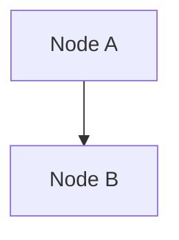
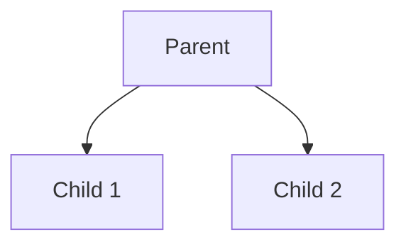
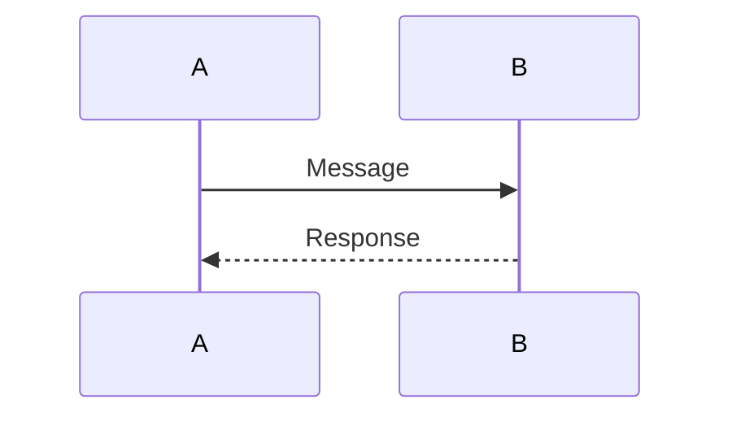
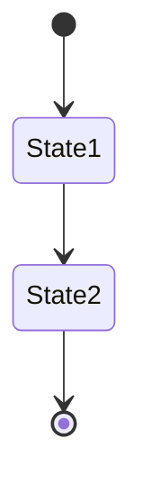
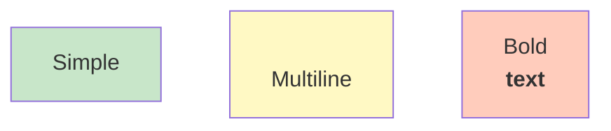
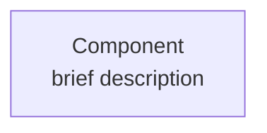
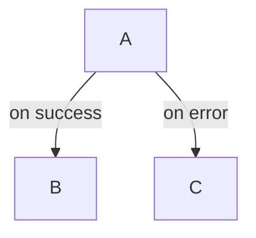
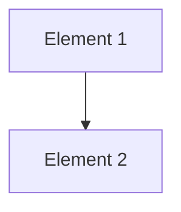

# Architecture Diagrams Maintenance Guide

How to keep architecture diagrams up-to-date as the system evolves.

---

## 📋 Overview

This document provides guidelines for maintaining and updating the architecture diagrams as the Zali project evolves.

**Diagram Files:**
- [ARCHITECTURE_DIAGRAMS.md](ARCHITECTURE_DIAGRAMS.md) - Core system architecture
- [FRONTEND_COMPONENTS.md](FRONTEND_COMPONENTS.md) - React components
- [CONTRACT_ARCHITECTURE.md](CONTRACT_ARCHITECTURE.md) - Smart contracts
- [DATA_FLOW_ARCHITECTURE.md](DATA_FLOW_ARCHITECTURE.md) - Data & deployment
- [SYSTEM_OVERVIEW.md](SYSTEM_OVERVIEW.md) - High-level overview
- [ARCHITECTURE_QUICK_REFERENCE.md](ARCHITECTURE_QUICK_REFERENCE.md) - Quick reference
- [ARCHITECTURE_INDEX.md](ARCHITECTURE_INDEX.md) - Navigation guide

---

## 🔄 When to Update Diagrams

### ✅ Always Update When:

1. **New Component Added**
   - Add to component hierarchy
   - Update component tree diagrams
   - Add to reusability matrix

2. **New Route/Page Created**
   - Add to route structure diagram
   - Update page hierarchy
   - Document component tree

3. **Smart Contract Function Added**
   - Add to function call flow
   - Update state modification timeline
   - Update error handling flow

4. **New Integration Added**
   - Update integration points diagram
   - Add to dependency flow
   - Document data sources

5. **Architecture Decision Made**
   - Document in architecture decisions section
   - Update affected diagrams
   - Explain rationale

6. **Major Refactor**
   - Review all related diagrams
   - Update component relationships
   - Update data flow

### ✅ Periodically Update:

- Monthly: Review all diagrams for accuracy
- Before release: Update deployment diagrams
- After major feature: Update affected diagrams

---

## 🛠️ How to Update Diagrams

### Step 1: Identify Which Files to Update

**Check this table:**

| Change Type | Files to Update |
|-------------|-----------------|
| Frontend component | FRONTEND_COMPONENTS.md, SYSTEM_OVERVIEW.md |
| Smart contract function | CONTRACT_ARCHITECTURE.md, SYSTEM_OVERVIEW.md |
| Route/page | ARCHITECTURE_INDEX.md, FRONTEND_COMPONENTS.md |
| State/Zustand | ARCHITECTURE_DIAGRAMS.md #5 |
| Data flow | DATA_FLOW_ARCHITECTURE.md, SYSTEM_OVERVIEW.md |
| Error handling | ARCHITECTURE_DIAGRAMS.md #8, DATA_FLOW_ARCHITECTURE.md #39 |
| Deployment | DATA_FLOW_ARCHITECTURE.md #40-42 |
| Integration | CONTRACT_ARCHITECTURE.md #31 |

### Step 2: Locate the Diagram

Find the Mermaid diagram code block in markdown:

```mermaid
graph TD
    ... diagram code ...
```

### Step 3: Update the Diagram

Edit the Mermaid syntax. Common operations:

**Add a node:**
```
NewNode["Node Label<br/>Description"]
```

**Add a connection:**
```
ParentNode --> NewNode
```

**Update styling:**
```
style NewNode fill:#c8e6c9
```

### Step 4: Test Rendering

- Verify syntax is valid
- Check in GitHub markdown preview
- Ensure connections are correct
- Verify styling applies

### Step 5: Commit Changes

```bash
git add [filename].md
git commit -m "Update [diagram name] - add [what changed]"
```

---

## 📝 Mermaid Diagram Syntax Reference

### Common Diagram Types

**Flowchart (Top to Bottom):**


**Hierarchy/Tree:**


**Sequence (Timeline):**


**State Machine:**


### Node Styling



---

## 🎨 Color Scheme

Use consistent colors across diagrams:

| Purpose | Color | Hex |
|---------|-------|-----|
| Frontend/UI | Light Blue | #e1f5ff |
| State Management | Light Purple | #f3e5f5 |
| Smart Contracts | Light Green | #e8f5e9 |
| Data/Services | Light Yellow | #fff9c4 |
| External/Integration | Light Orange | #ffccbc |
| Error States | Light Red | #ffebee |
| Success States | Medium Green | #c8e6c9 |

---

## ✏️ Diagram Content Guidelines

### Clear Node Labels



**Format:** `Node Name<br/>brief description`

### Meaningful Connections

Label connections when non-obvious:



### Logical Organization

- Group related items in subgraphs
- Arrange top-to-bottom or left-to-right
- Use consistent spacing

### Descriptive Headers

Include diagram number and purpose:

```markdown
## 15. Data Request Patterns

How the frontend requests data from contracts.
```

---

## 🔍 Diagram Checklist

Before committing changes, verify:

### Content
- [ ] All elements are accurate
- [ ] No outdated information
- [ ] New components included
- [ ] Connections are correct
- [ ] Labels are clear

### Formatting
- [ ] Consistent naming conventions
- [ ] Proper Mermaid syntax
- [ ] Rendering works in GitHub
- [ ] Colors are consistent
- [ ] Readable font sizes

### Documentation
- [ ] Diagram has title
- [ ] Clear purpose described
- [ ] Related docs referenced
- [ ] Examples provided where helpful

### Organization
- [ ] In correct file
- [ ] Proper numbering
- [ ] Cross-referenced in index
- [ ] Linked from overview

---

## 📚 Documentation Updates

When adding new diagram:

### 1. Add to Source File

```markdown
## 23. New Diagram Name

Brief description of what the diagram shows.



Related: [Other Diagram Name](link)
```

### 2. Add to Index Table

In ARCHITECTURE_INDEX.md, add to reference table:

```markdown
| 48 | New Diagram | FILENAME.md | Purpose |
```

### 3. Update Navigation

If it's a new file, add to ARCHITECTURE_INDEX.md navigation section.

### 4. Link from Overview

If major, add link from SYSTEM_OVERVIEW.md.

### 5. Update Learning Paths

If affects learning paths, update ARCHITECTURE_INDEX.md.

---

## 🔗 Cross-Referencing

### Link to Diagrams

In text, reference diagrams:

```markdown
See Component Hierarchy diagram (ARCHITECTURE_DIAGRAMS.md #4) for structure.
```

### Link Between Files

```markdown
Related: [Frontend Components](FRONTEND_COMPONENTS.md)
```

### Link to Sections

```markdown
See [Smart Contract Interactions](#3-smart-contract-interactions-diagram)
```

---

## 🚀 Common Update Scenarios

### Scenario 1: Add New Component

**Step 1:** Add to FRONTEND_COMPONENTS.md #4

```mermaid
PlayPage (/play)
├── GameLayout
│   ├── QuestionCard
│   ├── OptionButtons
│   ├── Timer
│   ├── ScoreDisplay
│   ├── RewardCard
│   └── NewComponent      ← ADD HERE
```

**Step 2:** Update component count in summary

**Step 3:** Add to component list in relevant doc

**Step 4:** Commit with message:
```
Add NewComponent to component hierarchy diagram
```

### Scenario 2: Add Smart Contract Function

**Step 1:** Add to CONTRACT_ARCHITECTURE.md #24

```mermaid
Functions["Functions"]
    AddQ["addQuestion"]
    Submit["submitAnswer"]
    DeactivateQ["deactivateQuestion"]
    NewFunc["newFunction"]        ← ADD HERE
    GetQ["getQuestion"]
```

**Step 2:** Add function spec to table

**Step 3:** Update gas optimization if needed

**Step 4:** Commit with message:
```
Add newFunction to contract architecture diagrams
```

### Scenario 3: New Data Flow Path

**Step 1:** Update DATA_FLOW_ARCHITECTURE.md relevant section

**Step 2:** Update SYSTEM_OVERVIEW.md if affects overview

**Step 3:** Add to "How it works" documentation

**Step 4:** Commit with message:
```
Add new data flow path for [feature]
```

---

## 🧪 Testing Changes

### Local Testing

1. Edit markdown file
2. Preview in VS Code with markdown preview
3. Check Mermaid rendering

### GitHub Testing

1. Commit to feature branch
2. Create PR on GitHub
3. Preview in PR
4. Verify diagrams render correctly

### Syntax Validation

Use Mermaid Live Editor:
- Go to [mermaid.live](https://mermaid.live)
- Paste Mermaid code
- Verify it renders
- Check for errors

---

## ⚠️ Common Mistakes to Avoid

### ❌ Don't

- Mix diagram types in one section
- Use inconsistent naming
- Add unrelated diagrams
- Forget to update index
- Leave outdated diagrams
- Create diagrams too large
- Use unclear labels
- Reference non-existent elements

### ✅ Do

- Keep diagrams focused
- Use consistent colors
- Update index when adding
- Remove outdated content
- Keep diagrams readable
- Use clear labels
- Cross-reference related docs
- Test before committing

---

## 📞 Review Checklist for PRs

When reviewing PR with diagram changes:

- [ ] Diagrams are accurate
- [ ] Syntax is valid
- [ ] Rendering works
- [ ] Consistent with other diagrams
- [ ] Index updated if new
- [ ] Related docs updated
- [ ] Commit message clear
- [ ] No breaking changes

---

## 🔄 Version Control

### Commit Messages

**Format:**
```
[Diagram Type] [Action] - [Description]

Examples:
- Add system architecture diagram
- Update component hierarchy - add new component
- Fix data flow documentation
- Refactor deployment diagram for clarity
```

### Branch Naming

If working on multiple diagrams:
```
feature/update-architecture-diagrams
docs/architecture-refresh
```

---

## 📊 Maintenance Schedule

### Weekly
- Monitor GitHub issues for architecture-related questions
- Update quick reference if bugs found

### Monthly
- Review all diagrams for accuracy
- Check for outdated information
- Update if needed

### Quarterly (Before Release)
- Complete architecture review
- Update deployment diagrams
- Refresh security diagrams

### Yearly (Major Update)
- Comprehensive diagram audit
- Refactor if needed
- Update learning paths

---

## 🎓 Training New Contributors

When onboarding new contributor:

1. Have them read ARCHITECTURE_INDEX.md
2. Show them the diagram files
3. Explain Mermaid syntax
4. Have them update a diagram
5. Review their changes
6. Merge when ready

---

## 📞 Getting Help

### Questions About Diagrams?

- Check ARCHITECTURE_INDEX.md
- Review diagram comments in markdown
- Ask in discussions section

### Mermaid Syntax Questions?

- See Mermaid docs: [mermaid.js.org](https://mermaid.js.org)
- Use Mermaid Live Editor

### Architecture Questions?

- Ask in issues with `architecture` label
- Tag @DeborahOlaboye or maintainers

---

## 🚀 Future Improvements

Potential enhancements:

- [ ] Add interactive diagrams (reveal on hover)
- [ ] Create SVG exports for presentations
- [ ] Add diagram generation from code
- [ ] Create video walkthroughs
- [ ] Add component lifecycle diagrams
- [ ] Create swimlane diagrams
- [ ] Add performance timelines

---

**Maintenance Guide Version:** 1.0  
**Last Updated:** January 26, 2026  
**Status:** Complete

For diagram files, see [ARCHITECTURE_INDEX.md](ARCHITECTURE_INDEX.md)
