# Smart Contract Architecture & Interactions

Detailed diagrams for smart contract structure, functions, and interactions.

---

## 1. SimpleTriviaGame Contract Structure

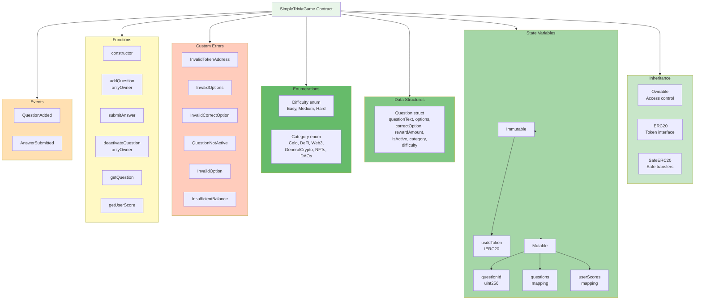

---

## 2. Function Call Flow

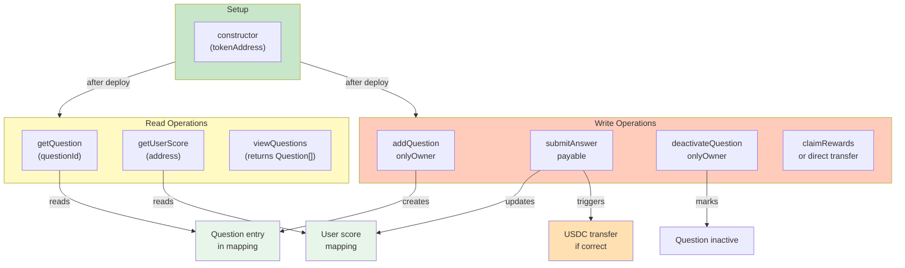

---

## 3. State Modification Timeline

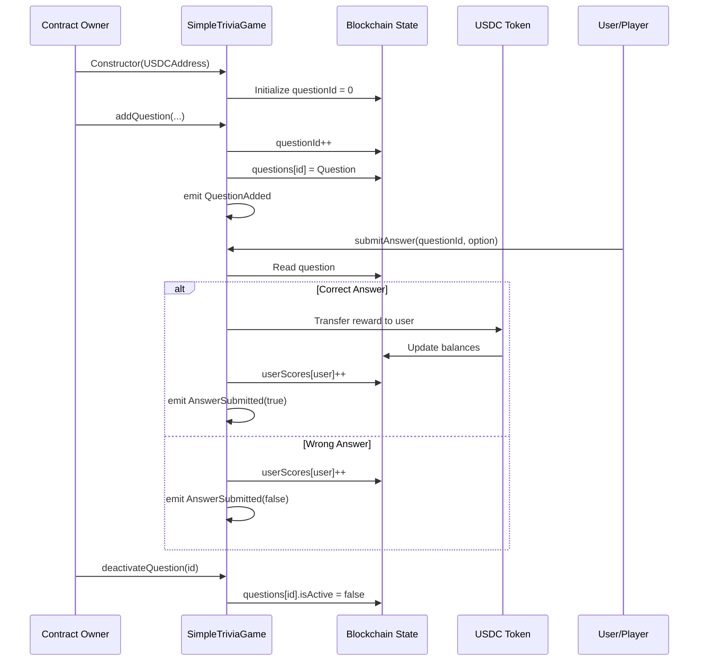

---

## 4. Access Control Diagram

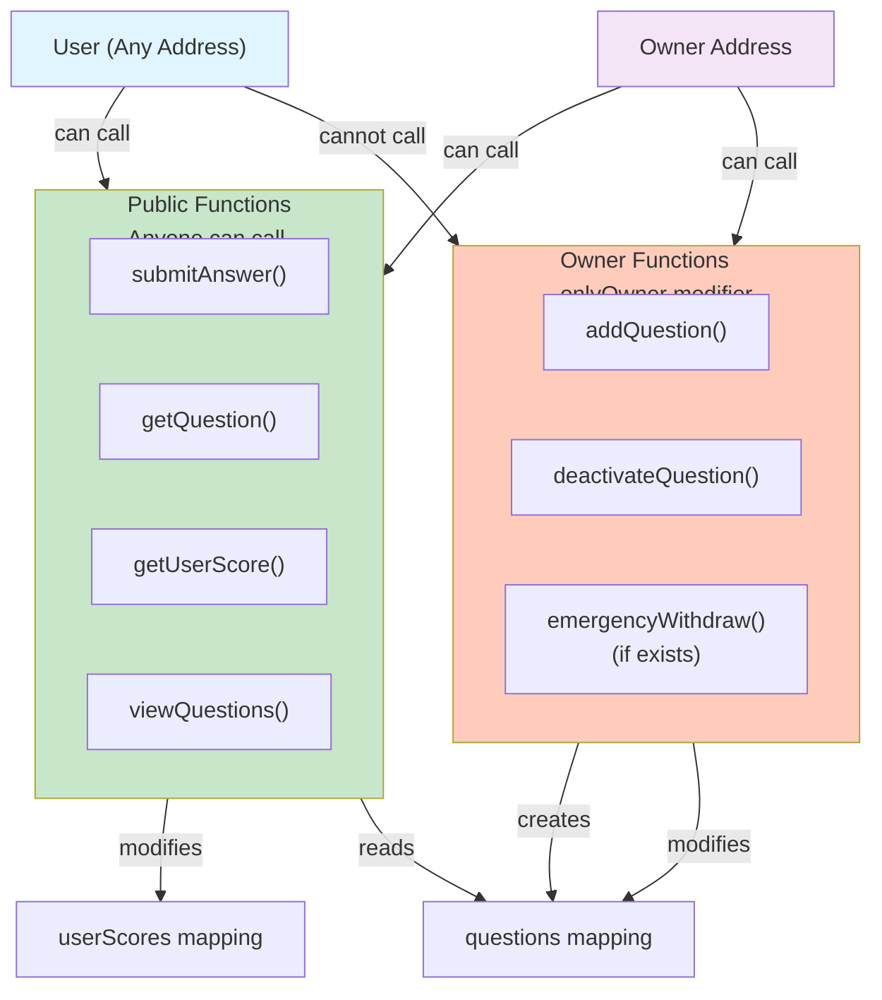

---

## 5. Data Structure Relationships

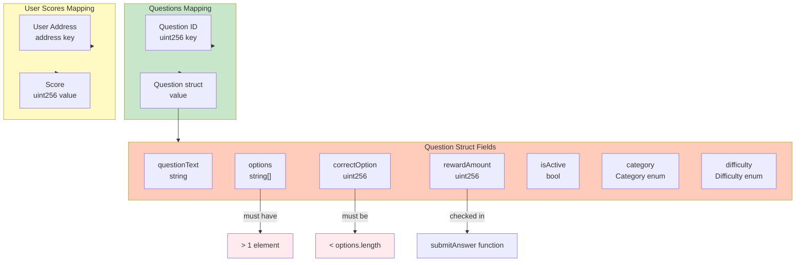

---

## 6. Event Flow Diagram

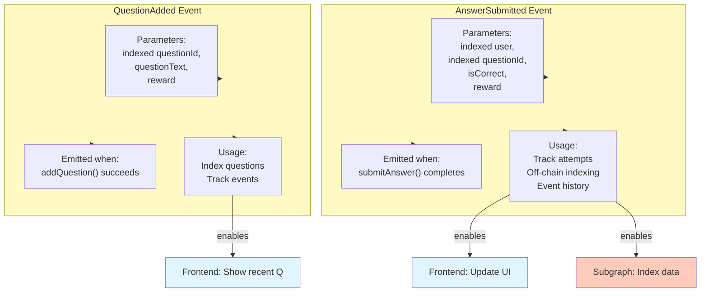

---

## 7. Gas Optimization Considerations

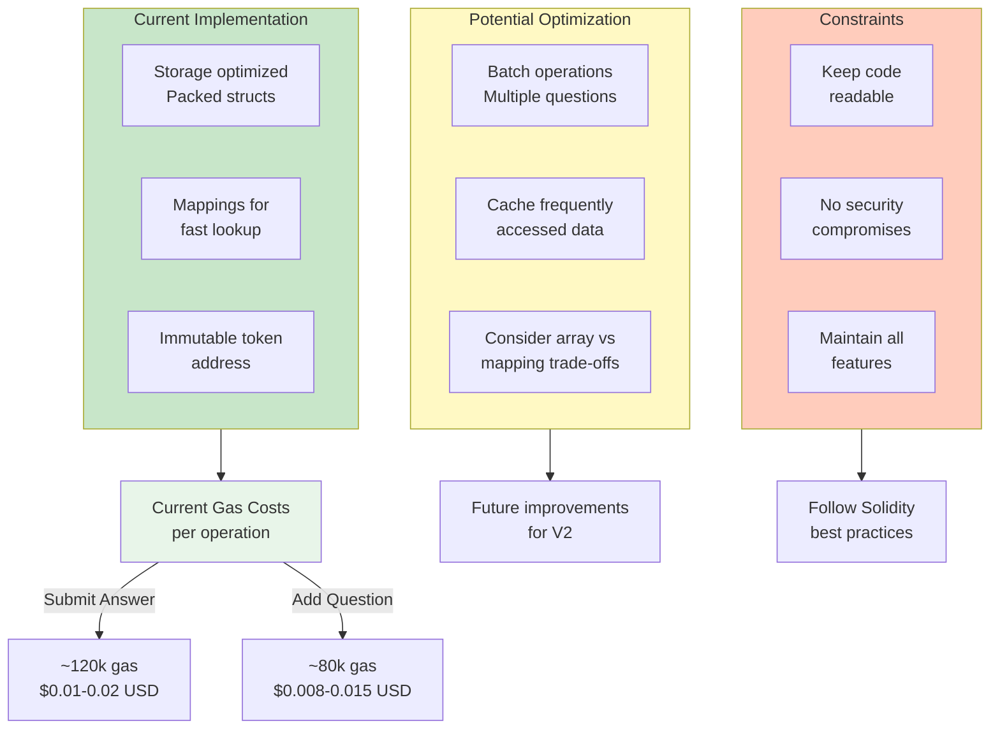

---

## 8. Error Handling Flow

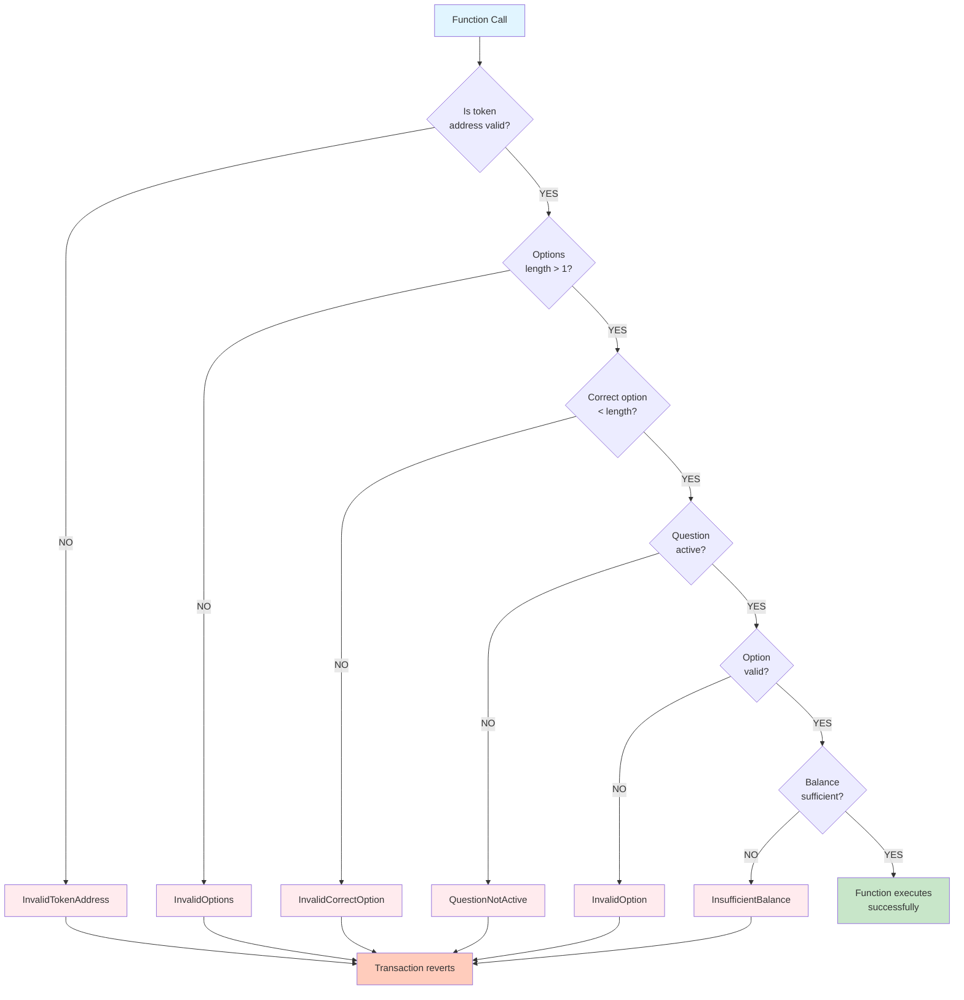

---

## 9. Integration Points

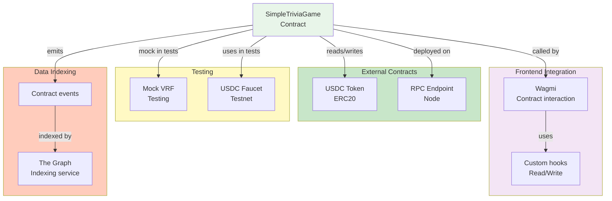

---

## 10. Contract Upgrade Path (Future)

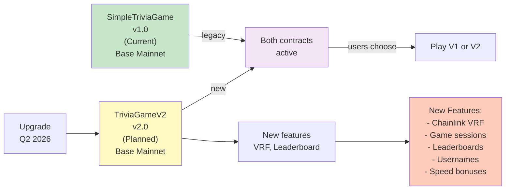

---

## 11. Testing Strategy

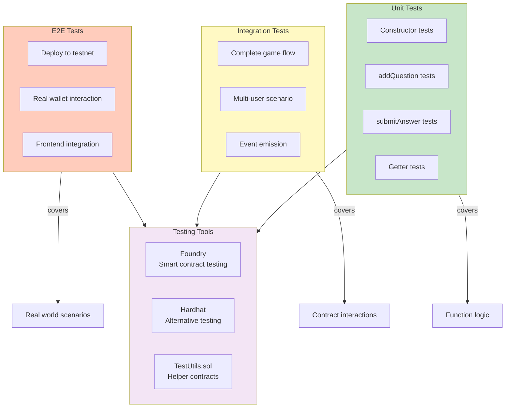

---

## 12. Security Audit Points

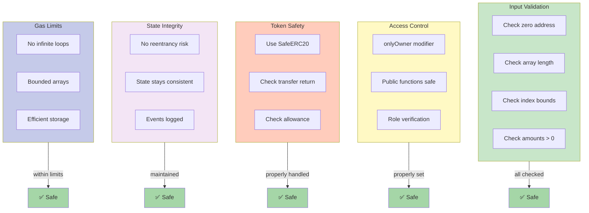

---

## Function Specifications Quick Reference

| Function | Access | Params | Returns | Gas |
|----------|--------|--------|---------|-----|
| constructor | - | USDC address | - | ~50k |
| addQuestion | onlyOwner | text, options[], correct, reward, category, difficulty | - | ~80k |
| submitAnswer | public | questionId, selectedOption | - | ~120k |
| deactivateQuestion | onlyOwner | questionId | - | ~20k |
| getQuestion | view | questionId | Question | ~5k |
| getUserScore | view | address | uint256 | ~5k |
| viewQuestions | view | - | Question[] | ~Nk |

---

**Document Version:** 1.0  
**Last Updated:** January 26, 2026  
**Status:** Complete
