# Data Flow & Deployment Architecture

Comprehensive data flow diagrams and deployment architecture for the Zali application.

---

## 1. Complete User Flow Diagram

```mermaid
graph TD
    Start["🟢 START:<br/>User visits app"]
    
    Connect["🔗 Connect Wallet"]
    SignMessage["📝 Sign message<br/>(Authentication)"]
    
    NavMenu["📍 Navigate to<br/>Play page"]
    
    ViewQuestion["👀 View Question"]
    SelectAnswer["✓ Select Answer"]
    SubmitTx["📤 Submit<br/>Transaction"]
    
    WalletApprove["👛 Wallet approves<br/>transaction"]
    BlockchainExec["⛓️ Contract<br/>executes"]
    
    CheckAnswer["🔍 Check if<br/>correct"]
    
    subgraph Correct["✅ Answer Correct"]
        TransferReward["💰 Transfer USDC<br/>reward"]
        UpdateScore["📊 Increment<br/>user score"]
        ShowSuccess["✨ Show success<br/>message"]
    end
    
    subgraph Incorrect["❌ Answer Incorrect"]
        ShowFail["😕 Show failure<br/>message"]
    end
    
    EventEmit["📢 Contract emits<br/>AnswerSubmitted"]
    FrontendUpdate["🔄 Frontend<br/>updates UI"]
    
    NextAction["⚡ User can:<br/>Next question or<br/>View profile"]
    
    Start --> Connect
    Connect --> SignMessage
    SignMessage -->|User authenticated| NavMenu
    
    NavMenu --> ViewQuestion
    ViewQuestion --> SelectAnswer
    SelectAnswer --> SubmitTx
    
    SubmitTx --> WalletApprove
    WalletApprove --> BlockchainExec
    BlockchainExec --> CheckAnswer
    
    CheckAnswer -->|Correct| Correct
    CheckAnswer -->|Incorrect| Incorrect
    
    TransferReward --> UpdateScore
    UpdateScore --> ShowSuccess
    ShowSuccess --> EventEmit
    
    ShowFail --> EventEmit
    
    EventEmit --> FrontendUpdate
    FrontendUpdate --> NextAction

    style Start fill:#c8e6c9
    style Connect fill:#fff9c4
    style Correct fill:#c8e6c9
    style Incorrect fill:#ffccbc
    style NextAction fill:#f3e5f5
```



---

## 2. Transaction Lifecycle


---

## 3. State Synchronization Flow


---

## 4. Data Request Patterns


---

## 5. Error Recovery Flow

```mermaid
graph TB
    subgraph ErrorTypes["Error Types"]
        NetworkErr["Network Error<br/>RPC failure"]
        UserReject["User Rejection<br/>Wallet cancel"]
        ValidErr["Validation Error<br/>Invalid input"]
        ContractErr["Contract Error<br/>Revert"]
        GasErr["Gas Error<br/>Out of gas"]
    end
    
    subgraph Detection["Error Detection"]
        CatchErr["Catch error<br/>from try-catch"]
        ClassifyErr["Classify error<br/>type"]
        FindHandler["Find error<br/>handler"]
    end
    
    subgraph Recovery["Recovery Actions"]
        RetryErr["Retry operation"]
        ShowErr["Show user<br/>message"]
        LogErr["Log error<br/>to service"]
        SuggestFix["Suggest fix<br/>to user"]
    end
    
    subgraph Outcome["Outcome"]
        Success["✅ Recovered"]
        Fallback["⚠️ Fallback UI"]
        Manual["🆘 Manual<br/>intervention"]
    end
    
    ErrorTypes --> Detection
    Detection --> Recovery
    Recovery --> Outcome
    
    NetworkErr -->|automatic| RetryErr
    UserReject -->|manual| ShowErr
    ValidErr -->|automatic| SuggestFix
    ContractErr -->|display| ShowErr
    GasErr -->|suggest| SuggestFix
    
    RetryErr -->|success| Success
    RetryErr -->|fail| LogErr
    ShowErr --> Manual
    SuggestFix --> UserChoice["User tries again"]

    style ErrorTypes fill:#ffebee
    style Detection fill:#ffccbc
    style Recovery fill:#fff9c4
    style Outcome fill:#c8e6c9
```



---

## 6. Deployment Architecture - Development

```mermaid
graph TB
    subgraph LocalDev["Local Development"]
        direction LR
        LocalNode["Local Node<br/>Hardhat/Anvil"]
        LocalContracts["Contracts<br/>Local copy"]
        LocalFrontend["Frontend<br/>localhost:3000"]
    end
    
    subgraph BaseTestnet["Base Testnet"]
        direction LR
        TestRPC["Base Testnet<br/>RPC"]
        TestContracts["Test Contracts<br/>Deployed"]
        TestFaucet["Test Faucet<br/>Free USDC"]
    end
    
    subgraph Dev["Dev Environment"]
        TestFrontend["Frontend<br/>dev.example.com"]
        TestAnalytics["Analytics<br/>Separate"]
    end
    
    subgraph Staging["Staging Environment"]
        StagingRPC["Base Testnet<br/>RPC"]
        StagingContracts["Contracts<br/>Test version"]
        StagingFrontend["Frontend<br/>staging.example.com"]
    end
    
    Developer["👨‍💻 Developer"]
    CI["GitHub Actions<br/>CI/CD"]
    
    Developer -->|code| LocalDev
    LocalDev -->|test| LocalNode
    LocalDev -->|verify| LocalContracts
    
    Developer -->|push to git| CI
    CI -->|run tests| BaseTestnet
    CI -->|build| TestFrontend
    
    CI -->|release branch| Staging
    Staging -->|manual test| StagingFrontend
    
    style LocalDev fill:#c8e6c9
    style BaseTestnet fill:#fff9c4
    style Dev fill:#f3e5f5
    style Staging fill:#ffccbc
```



---

## 7. Production Deployment

```mermaid
graph TB
    subgraph Production["🚀 Production"]
        direction TB
        BaseMainnet["Base Mainnet<br/>Network"]
        ProdContract["SimpleTriviaGame<br/>v1.0<br/>0x7409Cbcb..."]
        USDC["USDC Token<br/>0x833589fC..."]
        
        ProdFrontend["Frontend<br/>app.zali.example"]
        CDN["CDN<br/>Cloudflare"]
        DNS["DNS<br/>Domain"]
    end
    
    subgraph Monitoring["📊 Monitoring"]
        Logs["Logs<br/>CloudWatch"]
        Analytics["Analytics<br/>Google Analytics"]
        Alerts["Alerts<br/>PagerDuty"]
    end
    
    subgraph Backup["🔒 Backup & Security"]
        IPFS["IPFS<br/>Data storage"]
        Backup["Database<br/>Backup"]
        Security["Security<br/>Audits"]
    end
    
    Users["👥 Users"]
    
    Users -->|visit| DNS
    DNS -->|resolve| CDN
    CDN -->|serve| ProdFrontend
    ProdFrontend -->|interact| ProdContract
    ProdContract -->|transfer| USDC
    ProdContract -->|on| BaseMainnet
    
    BaseMainnet -->|emit events| Logs
    ProdFrontend -->|track| Analytics
    Logs -->|alert on error| Alerts
    
    ProdFrontend -->|store| IPFS
    BaseMainnet -->|data to| Backup
    ProdContract -->|audited| Security

    style Production fill:#c8e6c9
    style Monitoring fill:#fff9c4
    style Backup fill:#ffccbc
```

---

## 8. CI/CD Pipeline

```mermaid
graph LR
    Developer["👨‍💻 Developer<br/>Push to GitHub"]
    
    GitHub["GitHub<br/>Repository"]
    
    Trigger["GitHub Actions<br/>Triggered"]
    
    subgraph Tests["Testing Stage"]
        ContractTests["Contract Tests<br/>Foundry"]
        LintTests["Lint Tests<br/>ESLint"]
        TypeTests["Type Tests<br/>TypeScript"]
        E2ETests["E2E Tests<br/>Playwright"]
    end
    
    Results["✅ All Pass?"]
    
    Fail["❌ Build Failed<br/>Notify Developer"]
    
    Pass["✅ Build Passed"]
    
    subgraph Build["Build Stage"]
        BuildContracts["Build Contracts<br/>ABI generation"]
        BuildFrontend["Build Frontend<br/>Next.js"]
    end
    
    Artifacts["📦 Build Artifacts<br/>Ready"]
    
    Deploy["🚀 Deploy to<br/>Staging"]
    
    Verify["🔍 Verify<br/>Deployment"]
    
    Ready["✨ Ready for<br/>Production"]
    
    Developer --> GitHub
    GitHub -->|on push| Trigger
    
    Trigger --> Tests
    Tests --> Results
    Results -->|failed| Fail
    Results -->|passed| Pass
    Pass --> Build
    Build --> Artifacts
    Artifacts --> Deploy
    Deploy --> Verify
    Verify --> Ready

    style Developer fill:#e1f5ff
    style Tests fill:#c8e6c9
    style Build fill:#fff9c4
    style Fail fill:#ffebee
    style Ready fill:#a5d6a7
```



---

## 9. Frontend Data Fetching Architecture


---

## 10. Real-Time Event Subscriptions


---

## 11. Error Boundary Strategy


---

## 12. Performance Optimization Flows


---

## 13. State Persistence Strategy


---

**Document Version:** 1.0  
**Last Updated:** January 26, 2026  
**Status:** Complete

See [ARCHITECTURE_DIAGRAMS.md](ARCHITECTURE_DIAGRAMS.md) for system-level architecture.
