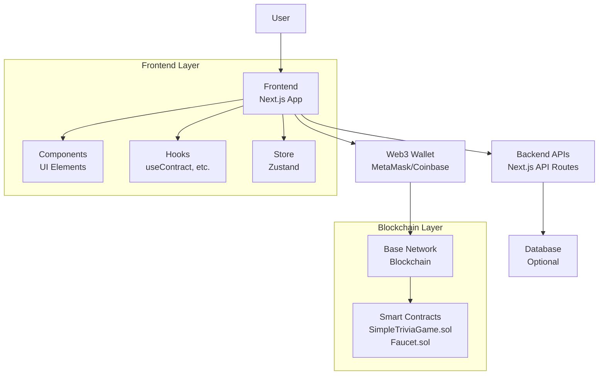
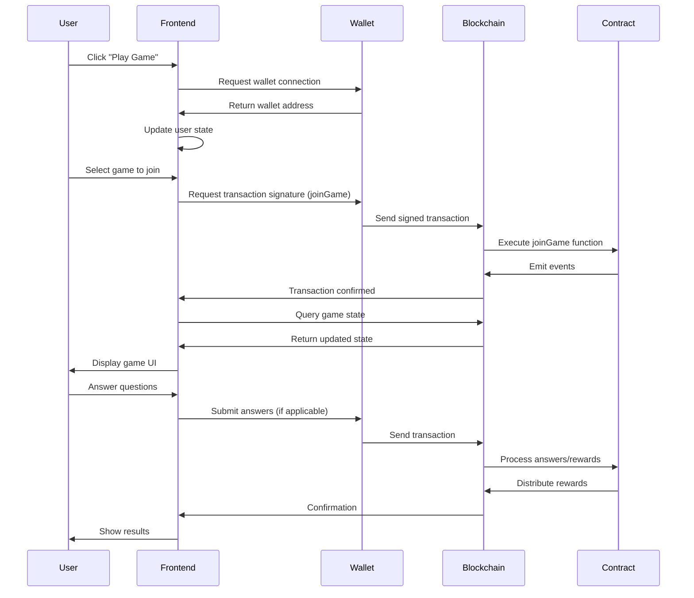
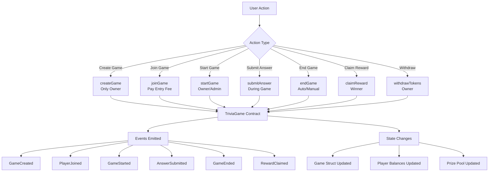

# Architecture Diagrams

This document contains visual architecture diagrams for the Zali Web3 Trivia Game.

## Table of Contents

- [System Architecture](#system-architecture)
- [Data Flow](#data-flow)
- [Smart Contract Interactions](#smart-contract-interactions)
- [Component Hierarchy](#component-hierarchy)
- [State Management](#state-management)

## System Architecture

## Data Flow

## Smart Contract Interactions

