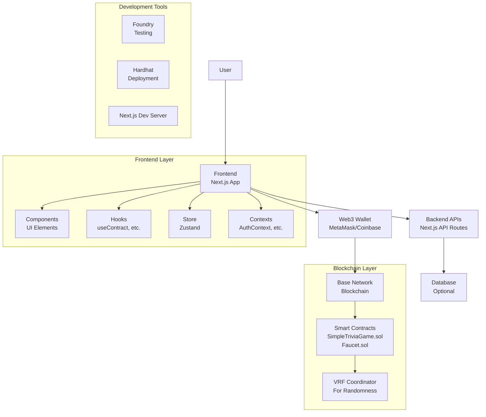
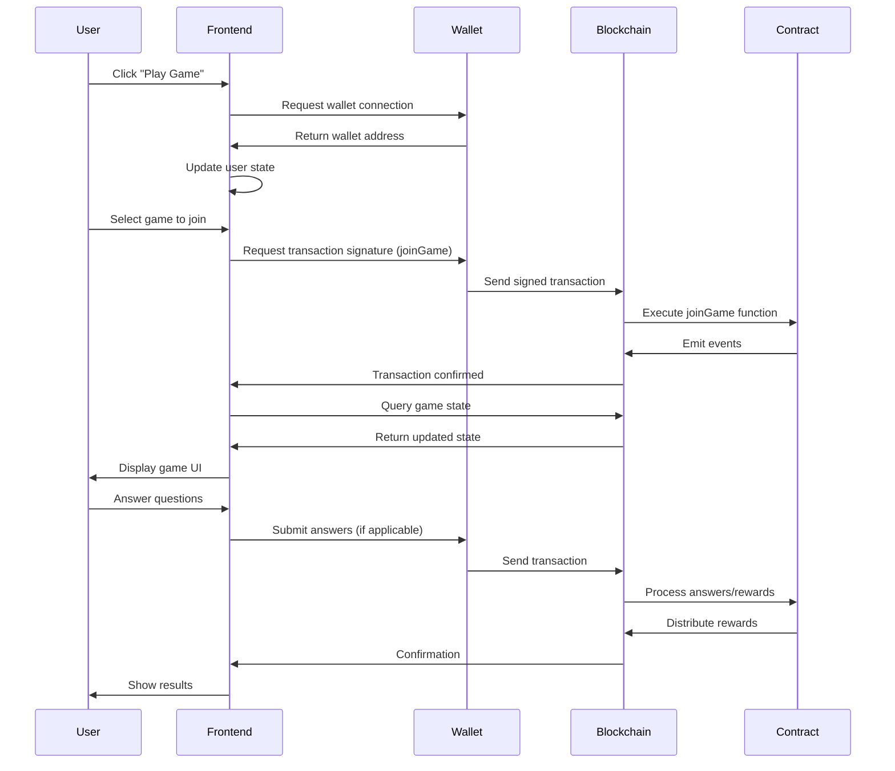
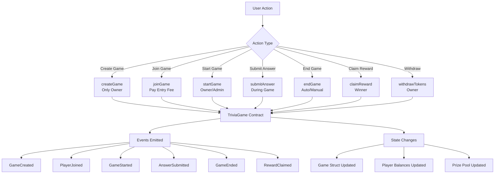
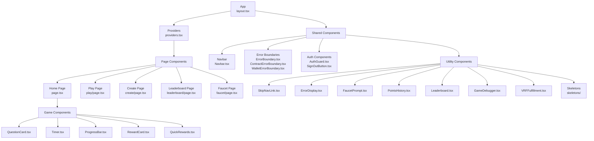
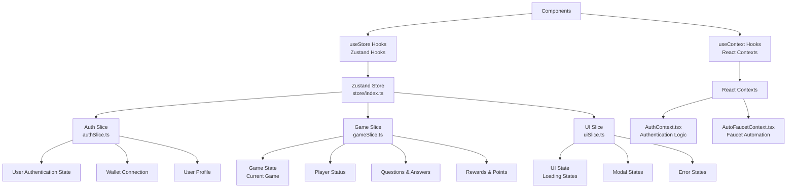
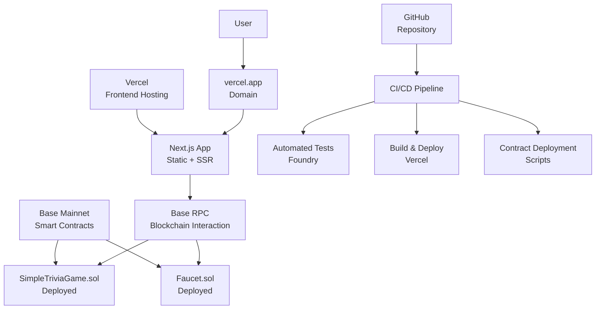

# Architecture Diagrams

This document contains visual architecture diagrams for the Zali Web3 Trivia Game.

## Table of Contents

- [System Architecture](#system-architecture)
- [Data Flow](#data-flow)
- [Smart Contract Interactions](#smart-contract-interactions)
- [Component Hierarchy](#component-hierarchy)
- [State Management](#state-management)
- [Deployment Architecture](#deployment-architecture)
- [Tools Used for Diagrams](#tools-used-for-diagrams)

## System Architecture

## Data Flow

## Smart Contract Interactions

## Component Hierarchy

## State Management

## Tools Used for Diagrams

- **Mermaid.js**: For creating diagrams directly in Markdown
- **GitHub**: For rendering Mermaid diagrams in README and docs
- **Draw.io/Excalidraw**: Alternative tools for more complex diagrams if needed

## Maintenance Notes

These diagrams should be kept updated as the codebase evolves:

- Update system architecture when adding new services or layers
- Modify data flow diagrams for new user interactions or API changes
- Expand component hierarchy as new components are added
- Update state management diagrams when new slices or contexts are introduced
- Review diagrams during major refactoring or architectural changes

Last updated: January 20, 2026

## Deployment Architecture

